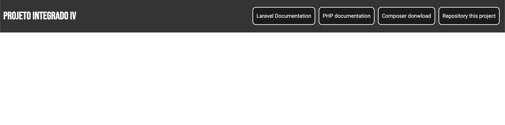

<p align="center"><a href="https://laravel.com" target="_blank"></a></p>

<p align="center">
<a href="https://github.com/laravel/framework/actions"></a>
<a href="https://packagist.org/packages/laravel/framework"></a>
<a href="https://packagist.org/packages/laravel/framework"></a>
<a href="https://packagist.org/packages/laravel/framework"></a>
</p>

# Projeto Integrado IV

## Sobre a aplicação:

Foi prosta a criação de um menu simples com quatro hiperlinks externos, dos quais foram escolhidos a documentação do framework, a documentação da linguagem, o donwload de uma das dependencias e por fim o link deste repositório. O menu segue as tags semanticas de "header", "nav" e "li", com os seus links abrindo em uma nova aba do navegador.



## Rodando localmente:

Para acessar a aplicação localmente é necessário ter instalado o php versão => 7.4 instalado. Caso necessário consulte<a href="https://www.php.net/manual/pt_BR/install.php"> documentação de instalação php aqui.</a> e o instalador de dependencias composer que pode ser baixado <a href="https://getcomposer.org/download/">aqui</a>.
<br>
Também será necessário ter o <a href="https://git-scm.com/downloads">git</a> já configurado em sua máquina
<br>

* Clone o projeto com o seguinte comando em um terminal:

```
git clone https://github.com/LeoCosta-dev/ProjetoIntegradoIV.git
```
ou
```
git clone git@github.com:LeoCosta-dev/ProjetoIntegradoIV.git
```

* Navegue para a pasta do projeto colando o comando abaixo no mesmo terminal:

```
cd ProjetoIntegradoIV
```

* Instale as dependencias do proejto com o comando abaixo já com o terminal aberto na pasta do proejto:
```
composer install
```

Inicialize o servidor com o comando abaixo ainda com o terminal aberto na pasta do proejto:

```
php artisan serve
```

Após esses passos o servidor será inicializado em:

```
http://localhost:8000
```

basta acessar esse endereço no navegador para visualizar a aplicação.